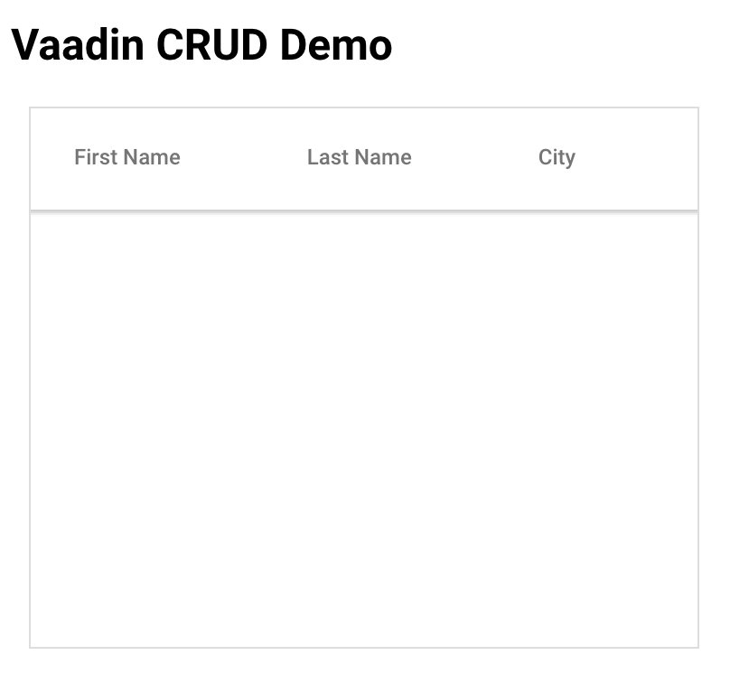

[[elements-crud-tutorial.tutorial]]
== Vaadin Elements CRUD Tutorial

[.author]
[name]#Juniper Belmont# <juniper.belmont@vaadin.com>

== Introduction
Remote data access is one of the most important components of any app. Vaadin Elements compose well with other web components and libraries to make this simple. In this tutorial, you will learn how to create a simple link:https://en.wikipedia.org/wiki/Create,_read,_update_and_delete[CRUD] app with Vaadin Elements and Polymer components.

This tutorial assumes you know the basics of web components and have link:https://docs.npmjs.com/getting-started/installing-node[npm] and link:http://bower.io[Bower] installed. Some knowledge of link:https://www.polymer-project.org/[Polymer] is also helpful.

You will use the [vaadinelement]#vaadin-grid# element, Polymer’s [elementname]#paper-input# and [elementname]#paper-button# components, the Polymer CLI, and PouchDB, a Javascript database that runs in the browser to simulate an external database.

See the following links for introductions to [vaadinelement]#vaadin-grid#, Polymer, and PouchDB:

* link:https://vaadin.com/docs/-/part/elements/vaadin-grid/overview.html#getting_started[How to install vaadin-grid]
* link:https://www.polymer-project.org/1.0/docs/tools/polymer-cli[How to install polymer-cli]
* link:https://www.polymer-project.org/1.0/docs/devguide/quick-tour[Introduction to Polymer]

* link:https://pouchdb.com/learn.html[Introduction to PouchDB]

== Setting Up Environment

. Create a basic application template. The Polymer CLI is the best way to do this.
+
[source,subs="normal"]
----
[prompt]#$# [command]#npm# install polymer-cli
[prompt]#$# [command]#polymer# init application
----
+
When prompted, use [elementname]#vaadin-simple-crud# as the name of the application.

. Then install the app dependencies.
+
[source,subs="normal"]
----
[prompt]#$# [command]#bower# install vaadin-grid paper-input pouchdb paper-button pouchdb-upsert
----

. Serve the app locally.
+
[source,subs="normal"]
----
[prompt]#$# [command]#power# serve
----
+
By default, the app is hosted locally at link:localhost:8080[localhost:8080]

== Getting Gtarted

From your working directory, open [filename]#/src/vaadin-simple-crud-app/vaadin-simple-crud-app.html#

At the top of this file, add the necessary dependencies.

[source,html,subs="normal"]
----
<link rel="import" href="../../bower_components/vaadin-grid/vaadin-grid.html">
<link rel="import" href="../../bower_components/paper-input/paper-input.html">
<link rel="import" href="../../bower_components/paper-button/paper-button.html">

----

Add some basic styling to the [elementname]#
----

Then create an empty grid under the [elementname]#<h2># element:

[source,html,subs="normal"]
----
<vaadin-grid id="grid">
  <table>
    <colgroup>
      <col name="firstName">
      <col name="lastName">
      <col name="city">
    </colgroup>
  </table>
</vaadin-grid>
----

This creates an empty grid with three columns. In the next section, you will pull rows from the database into this grid.

== Initializing the Database

Add a `_db` property in the `properties` object and then set up the database in the app’s `created` lifecycle callback.

[source,javascript,subs="normal"]
----
properties: {
  _db: Object,
},

created: function() {
  _db = new PouchDB('users');
},
----

[NOTE]
Visit the Polymer Developer Guide to learn more about the link:https://www.polymer-project.org/1.0/docs/devguide/properties[properties object] and link:https://www.polymer-project.org/1.0/docs/devguide/registering-elements#lifecycle-callbacks[Polymer lifecycle methods].

After the app has been initialized, tell the grid where to load data by setting its `items` property. To lazy-load data from a remote source, the `items` property can be set to a function, which will be called whenever new data is requested. This means that scrolling a long list will dynamically load more items.

For example:

[source,javascript,subs="normal"]
----
grid.items = function(params, callback) {
  // get params.count rows starting at params.index
  var rows = getRows(params.index, params.count);
  callback(rows, rows.length);
};
----

[NOTE]
Visit the [vaadinelement]#vaadin-grid# link:https://vaadin.com/docs/-/part/elements/vaadin-grid/datasources.html#function_data_sources[documentation page] to learn more about datasources.

Since this example will only have a few items in the database, simply get all the entries from the PouchDB database using `_db.allDocs()` and then extract the user data to create an array of rows that the grid can use.

Set the `grid.items` function in the element’s `ready` lifecycle method, which runs after the element is intialized.

[source,javascript,subs="normal"]
----
ready: function() {
  var grid = this.$.grid;

  grid.items = function(params, callback) {
    _db.allDocs({
      include_docs: true,
      skip: params.index,
      limit: params.count,
    }).then(function(response) {
      var rows = response.rows.map(function(row) {
        return row.doc;
      });
      callback(rows, response.total_rows)
    }).catch(function(err) {
      console.log(err);
    });
  };
},
----

The app loads all rows from the users database and populates the grid.

[[figure.grid-created]]
.The grid is created and ready for data.

[IMPORTANT]
TODO TODO TODO: explain why params.skip is not great.

== Creating Database Entries

Next you’ll add a way to create new entries into the database. Add the following to the template under the [vaadinelement]#vaadin-grid# element.

[source,html,subs="normal"]
----
<paper-input id="first" label="First Name" value={{userRecord.firstName}}></paper-input>
<paper-input label="Last Name" value={{userRecord.lastName}}></paper-input>
<paper-input label="City" value={{userRecord.city}}></paper-input>
<paper-button raised on-tap="handleSave" id="saveButton">Save Entry</paper-button>
----

Here you’ve created a data binding to a user record that will be inserted into the database when the save button is hit. The `userRecord` is bound to the values typed into the inputs, and the save button will save the typed values to the database.

Add the `userRecord` property to the `properties` object.

[source,javascript,subs="normal"]
----
properties: {
  _db: Object,

  // {firstName, lastName, city, _id}
  userRecord: {
    type: Object,
    value: function() {
      return {};
    },
  },
},
----

Next, you’ll add the code for saving the new entry to the database using a `handleSave` function. PouchDB has an link:https://github.com/pouchdb/upsert[add-on called pouchdb-upsert] that will add the record to the database if it does not exist and will update an existing item if there are new changes. This makes saving and updating entries much simpler for when you add the ability for the app to change existing records.

[TIP]
Every item in the database needs a unique id, so the document id is set to the current timestamp for convenience.

Below the `ready` callback add the `handleSave` function:

[source,javascript,subs="normal"]
----
handleSave: function() {
  var grid = this.$.grid;
  var newDoc = Object.assign({}, this.userRecord);

  // create a new id if one doesn't exist
  if (!newDoc.hasOwnProperty('_id')) {
    newDoc._id = new Date().toISOString();
  }

  // if doc exists, update new doc, otherwise create one
  _db.upsert(newDoc._id, function(doc) {
    // if the item already exists, update the _rev
    newDoc._rev = doc._rev;
    return newDoc;
  }).then(function(doc) {
    grid.refreshItems();
    this.set('userRecord', {});
  }.bind(this)).catch(function(err) {
    console.log(err)
  });
},
----

After the document has been added to the database, `grid.refreshItems()` tells the grid that there are changes, which updates the view. The current userRecord is cleared for the next update. Because the paper-input elements are bound to the userRecord object, the inputs are also cleared when userRecord is cleared.

Try adding a few records to the database. If you refresh the page, you’ll see that the database persists and all previously added records will populate the grid.

[IMPORTANT]
Note: a 404 error is sent to the console whenever `upsert` is called for an item that does not already exist in the database. This is normal and should be ignored.

== Updating Existing Entries

Now you’ll let the user select an item from the grid to update that entry from the database. Here you will add an event listener that will listen for the `selected-items-changed` event that is fired whenever an item is selected or deselected.

Add the listener to the grid by adding `on-selected-items-changed` to the grid element.

[source,html,subs="normal"]
----
<vaadin-grid id="grid" on-selected-items-changed="handleSelect">
  <table>
    <colgroup>
      <col name="firstName">
      <col name="lastName">
      <col name="city">
    </colgroup>
  </table>
</vaadin-grid>
----

Then add the `handleSelect` function, which will handle both selecting and deselecting grid rows.

[source,javascript,subs="normal"]
----
handleSelect: function(e) {
  var grid = this.$.grid;

  // on deselect clear the userRecord
  if (grid.selection.size === 0) {
    this.set('userRecord', {});
    return;
  }

  // selected() returns an array, so get the selected item
  var index = grid.selection.selected()[0];

  grid.getItem(index, function(err, item) {
    // we use Object.assign() to copy the item until we hit save
    this.set('userRecord', Object.assign({}, item));
  }.bind(this));
},
----

You can now edit one of the existing items in the database and save the changes by hitting the save button.

Modify the handleSave method to deselect any selected item after you save the entry. Update the upsert call.

[source,javascript,subs="normal"]
----
_db.upsert(newDoc._id, function(doc) {
  // if the item already exists, update the _rev
  newDoc._rev = doc._rev;
  return newDoc;
}).then(function(doc) {
  grid.refreshItems();
  *grid.selection.clear();*
}).catch(function(err) {
  console.log(err)
});
----

[[figure.save-button]]
.The save button saves a new entry or updates the selected entry.

== Deleting Entries

Lastly, you’ll add a delete button to remove items from the database.

Add the following to the template after the save button.

[source,html,subs="normal"]
----
<paper-button raised on-tap="handleDelete" id="deleteButton" disabled>Delete Entry</paper-button>
----

Update `handleSelect` to disable the delete button until an item is selected.

[source,javascript,subs="normal"]
----
handleSelect: function(e) {
  var grid = this.$.grid;

  // on deselect clear the userRecord
  if (grid.selection.size === 0) {
    this.set('userRecord', {});
    this.$.deleteButton.disabled = true;
    return;
  }

  // selected() returns an array, so get the selected item
  var index = grid.selection.selected()[0];

  grid.getItem(index, function(err, item) {
    // we use Object.assign() to copy the item until we hit save
    this.set('userRecord', Object.assign({}, item));
    *this.$.deleteButton.disabled = false;*
  }.bind(this));
},
----

Then add the `handleDelete` handler:

[source,javascript,subs="normal"]
----
handleDelete: function() {
  var grid = this.$.grid;

  _db.remove(this.userRecord._id, this.userRecord._rev).then(function(doc) {
    grid.selection.clear();
  }).then(function(doc) {
    grid.refreshItems();
  }).catch(function(err) {
    console.log(err);
  });
},
----

[[figure.delete-button]]
.The delete button removes the selected item from the database.

== Conclusion

Now you have a Polymer app that can create, read, update, and delete items from a remote database.

Have fun using [vaadinelement]#vaadin-grid# and Polymer in your apps!
